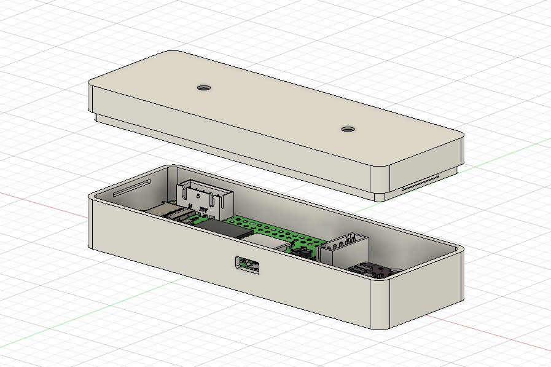

# Aircraft Noise Logger Enclosure

The purpose of this content is to provide designs and 3D printable models for an electronics enclosure for the Aircraft Noise Logger device.

### Built With

[Autodesk Fusion 360](https://www.autodesk.com/products/fusion-360/)

## Getting Started

- Download `noise_logger_base.stl` and `noise_logger_lid.stl` from this repository

### Prerequisites

- 3D printer
- PETG or more durable filament (PLA does not perform well in outdoor environments)

## Usage

For high quality, print at a layer height of .12.

## Acknowledgments

[michael.crandall@i3creations.com](mailto:michael.crandall@i3creations.com)